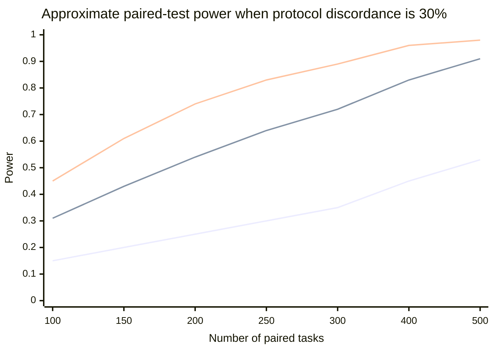
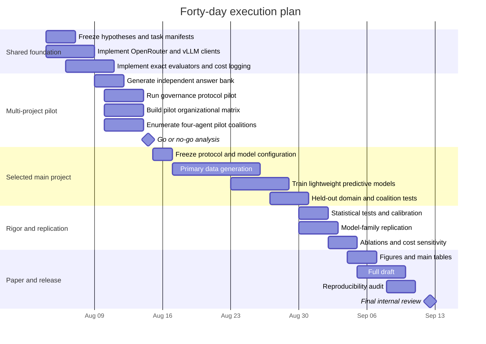

# Three Candidate ICLR Projects for Multi-Agent Selection and Organization

## Executive summary

This report designs three projects that can realistically be completed in **40 days** with a **€3,000 OpenRouter budget** and **four H100 GPUs**. The literature search covers primary work publicly available through **August 3, 2026**; it therefore includes 2025–2026 work but cannot include papers from 2027.

The central recommendation is to treat the three ideas as distinct scientific questions rather than variants of one router:

| Priority | Project | Scientific object | Core question | Novelty | Forty-day feasibility | Main risk |
|---:|---|---|---|---:|---:|---|
| **First** | **Epistemic governance** | Authority and influence structure | Why does a team discard a correct expert answer, and can a learned governance protocol prevent this? | High, provided the work goes beyond re-demonstrating expertise dilution | High | “Multi-Agent Teams Hold Experts Back” already establishes the phenomenon; the contribution must be causal diagnosis plus intervention |
| **Second** | **Delegation-equivalent task representations** | Task representation induced by organizational outcomes | Are tasks similar when they require the same organization, rather than when their texts or skills are similar? | Very high | Medium–high | Requires a sufficiently dense task-by-configuration outcome matrix |
| **Third** | **Coalition landscapes and complementarity** | Non-additive team value | Can coalition performance be predicted from individual and interaction effects, and when does top-$k$ agent selection fail? | High | High if restricted to four agents and one fixed aggregation protocol | Can resemble ordinary ensemble selection unless task-conditioned interactions are central |

The strongest **standalone** project is epistemic governance, but its novelty cannot simply be “experts are diluted.” A 2026 study already finds that heterogeneous LLM teams systematically underperform their best member even when the expert is identified, with losses up to 41.1%; it attributes much of the failure to overcompromising and expertise dilution. ([arxiv.org](https://arxiv.org/html/2602.01011v4)) The proposed paper must therefore contribute a **causal influence model**, controlled authority interventions, and a selector that chooses an epistemic constitution for each task.

The highest-upside representation project is delegation equivalence. DecoR represents queries through skills, knowledge, and difficulty; EvoRoute retrieves experience using task, role, and tool signals; RouteProfile studies how model profiles should integrate interaction histories. None of these defines task similarity by the **ranking of complete multi-agent organizations induced by the task**. ([arxiv.org](https://arxiv.org/html/2605.25558v1))

The coalition project is the safest route to a clean, rigorous empirical paper. It requires no reinforcement learning and can reuse cached individual answers. Its main contribution should be an empirical and predictive characterization of the coalition-value surface, not merely the observation that diverse agents can help.

### Recommended resource allocation

A single full project should consume approximately:

| Resource | Planned use |
|---|---|
| OpenRouter | €300–€900 for primary experiments, €300–€600 for repeated seeds and API-model validation, €300 contingency |
| H100 inference | Approximately 100–400 aggregate GPU-hours, depending on project and output length |
| H100 training | Approximately 10–40 aggregate GPU-hours for frozen-embedding models, LoRA, matrix factorization, or set models |
| Human effort | One shared experiment harness, exact evaluators, reproducible task splits, automated cost logging, and paper-ready analysis scripts |

Current OpenRouter pricing makes the API budget substantially less restrictive than the deadline. As of August 3, 2026, OpenRouter lists Gemini 2.5 Flash at $0.30/$2.50 per million input/output tokens, GPT-5 Mini at $0.25/$2, Claude Sonnet 4.6 at $3/$15, and Qwen3-30B-A3B-Instruct-2507 at approximately $0.048/$0.193. Prices should be queried programmatically immediately before launching each experiment because model and provider prices may change. ([openrouter.ai](https://openrouter.ai/google/gemini-2.5-flash?utm_source=chatgpt.com))

## Research landscape and novelty boundary

### Core routing and competence-profile work

| Paper | Claim and method | Data and selected entity | Online status and uncertainty | Drift and coalitions | Main metrics | Gap relevant to the three projects |
|---|---|---|---|---|---|---|
| **DecoR** | Decomposes a query into skills, knowledge, and difficulty, retrieves matching historical logs, and routes using empirical model performance and cost. ([arxiv.org](https://arxiv.org/abs/2605.25558?utm_source=chatgpt.com)) | CodaSet; selects one **LLM** per query | Primarily offline retrieval; OOD fallback rather than a calibrated posterior | No explicit drift; no coalition | Task quality, cost, ID/OOD generalization | Similarity is capability-descriptive, not organization-response-based |
| **EvoRoute** | Retrieves prior workflow steps by semantic task, role, and tool compatibility; filters Pareto-dominated models and uses uncertainty-aware selection at each step. ([arxiv.org](https://arxiv.org/abs/2601.02695?utm_source=chatgpt.com)) | GAIA, BrowseComp+, and additional agentic tasks; selects an **LLM backbone** per workflow step | Continually growing experience store; Thompson-style exploration | Accumulates experience but does not explicitly model capability change; no joint coalition-value model | Success, monetary cost, latency | Routes model backbones inside predefined roles rather than learning team influence or coalition value |
| **ReSo** | Decomposes a task into a DAG and uses a Dynamic Agent Database plus a Collaborative Reward Model and UCB-like exploration to select agents for subtasks. ([aclanthology.org](https://aclanthology.org/2025.emnlp-main.808/)) | Math-MAS, SciBench-MAS; selects an **agent** per subtask | Online profile updates during learning; count-based exploration | Dynamic database, but performance is largely globally aggregated; no coalition-value estimation | Accuracy, token use, scalability | Closest to persistent agent competence, but does not model authority, influence, or non-additive coalition effects |
| **FlyRoute** | Builds capability profiles from quality-gated successful deployment interactions and explores under-profiled but relevant agents. ([arxiv.org](https://arxiv.org/html/2605.22057v2)) | Proprietary developer-support queries; selects one **expert agent** | Continual flywheel; profile-size uncertainty and targeted exploration | Motivated by evolving agents, but evaluation is largely stationary; no coalitions | Single-gold routing accuracy | Positive success stores do not model communication dynamics or team value |
| **Skill-conditional reputation** | Replaces global trust with $R(i\mid k)$, analyzes when cross-skill evidence helps, and exposes reputation laundering. ([arxiv.org](https://arxiv.org/abs/2606.14200?utm_source=chatgpt.com)) | Controlled simulations and 14 AppWorld agents; selects one **agent** | Primarily offline analysis; no active exploration policy | No temporal drift; no coalitions | Routing regret, success, attack-induced regret | Removes “global versus task-conditioned score” as a standalone novelty |
| **GraphPlanner** | Formulates workflow generation as an MDP that selects both an LLM and an agent role, using historical and within-workflow heterogeneous graph memory. ([arxiv.org](https://arxiv.org/html/2604.23626v1)) | Fourteen tasks in six domains; selects **role–LLM sequences** | RL-trained policy; stochastic exploration during training | Memory-aware but not explicitly drift-aware; produces workflows but does not estimate coalition interactions | Accuracy and computational cost | Strong workflow-generation baseline; no interpretable competence–influence decomposition |
| **ACRouter** | Treats routing as a continuous Context–Action–Feedback loop and evaluates streaming model selection with cumulative regret. ([arxiv.org](https://arxiv.org/html/2606.22902v1)) | CodeRouterBench with roughly 10,000 tasks and eight frontier models; selects one **LLM** | Online selected-action feedback; memory retrieval and bandit baselines | No explicit model drift; no coalitions | Average performance, cumulative regret, cost | Online history alone is no longer a novel contribution |
| **Agent Psychometrics** | Extends IRT with task features and decomposes agent ability into LLM and scaffold components to predict task-level success. ([arxiv.org](https://arxiv.org/abs/2604.00594?utm_source=chatgpt.com)) | SWE-bench Verified, SWE-bench Pro, Terminal-Bench 2.0, GSO; predicts an **agent’s** success | Offline probabilistic prediction; posterior uncertainty | Stationary; no coalition model | AUC and predictive generalization | Good statistical baseline for competence but not influence or team interactions |
| **TwinRouterBench** | Supplies static and live execution-grounded evaluation for step-level routing and tests whether cheaper substitutions preserve downstream success. ([arxiv.org](https://arxiv.org/html/2605.18859v1?utm_source=chatgpt.com)) | SWE-bench, BFCL, mtRAG, QMSum, PinchBench; evaluates **step-level model choices** | Benchmark rather than learning method | Dynamic execution, but not population drift; no coalition selection | Official resolution, tier accuracy, realized cost | Establishes the need for end-to-end execution rather than isolated judging |
| **WISERouter** | Formulates workload-budget routing as a constrained contextual bandit with offline and online variants and an $O(\sqrt T)$ regret result. ([arxiv.org](https://arxiv.org/abs/2607.23765?utm_source=chatgpt.com)) | RouterBench and SWE-bench; selects one **LLM** | Explicit online exploration and partial feedback | No explicit drift or coalitions | Utility, budget adherence, regret | Bandit routing alone is insufficient novelty |
| **RouteProfile** | Separates profile design from router design and finds that structured, query-level, trainable profiles improve routing and new-model generalization. ([arxiv.org](https://arxiv.org/html/2605.00180v1)) | Evaluates profiles across SimRouter, MLPRouter, and GraphRouter; profiles **LLMs** | Offline profile learning | New-model cold start, not temporal drift; no coalitions | Routing performance | A new project must define a different functional target for profiles, not merely a richer profile format |

Official implementations are available for [DecoR](https://github.com/lvbotenbest/DecoR), [ReSo](https://github.com/hengzzzhou/ReSo), [GraphPlanner](https://github.com/ulab-uiuc/GraphPlanner), [ACRouter](https://github.com/LanceZPF/agent-as-a-router), [TwinRouterBench](https://github.com/CommonstackAI/TwinRouterBench), and [RouteProfile](https://github.com/ulab-uiuc/RouteProfile). The paper pages explicitly report these releases. ([arxiv.org](https://arxiv.org/abs/2605.25558?utm_source=chatgpt.com))

### Multi-agent organization, influence, and coalition work

| Paper | Claim and method | Entities selected | Online or offline | Uncertainty, drift, coalitions | Main metrics | Remaining opening |
|---|---|---|---|---|---|---|
| **MasRouter** | Uses a cascaded controller to choose collaboration mode, roles, and role-specific LLMs. ([aclanthology.org](https://aclanthology.org/2025.acl-long.757/?utm_source=chatgpt.com)) | Complete MAS configuration | Offline-trained selector | No explicit historical uncertainty or drift; configuration-level selection | Accuracy, cost and overhead | Does not explain why an organization works or model competence versus influence |
| **MaAS** | Samples query-dependent architectures from an agentic supernet and jointly allocates calls, tools, and tokens. ([proceedings.mlr.press](https://proceedings.mlr.press/v267/zhang25bi.html?utm_source=chatgpt.com)) | Agentic architecture | Offline optimization | Architecture distribution, but no explicit longitudinal uncertainty | Quality and inference cost | Architecture search is covered; interpretable organizational equivalence remains open |
| **AgentRouter** | Builds a heterogeneous graph over questions, contextual entities, and agents, then learns routing distributions and weighted output aggregation. ([aclanthology.org](https://aclanthology.org/2026.acl-long.33/?utm_source=chatgpt.com)) | Agent subset or weighted collaboration | Offline supervised | Partially captures complementarity; no temporal drift | QA accuracy and collaboration performance | Coalition interactions are implicit, not analyzed as a task-conditioned value surface |
| **RouteMoA** | Screens models before inference, refines scores through self- and cross-assessment, and selects a cost-aware model subset for Mixture-of-Agents. ([aclanthology.org](https://aclanthology.org/2026.acl-long.558/?utm_source=chatgpt.com)) | LLM subset | Primarily offline | Coalition selection, but no persistent team-interaction model | Accuracy, cost, latency | Strong subset-selection baseline; no causal or interpretable complementarity decomposition |
| **Science of Scaling Agent Systems** | Controlled experiments show that architecture–task fit governs whether MAS helps; centralized coordination limits error amplification relative to independent configurations. ([arxiv.org](https://arxiv.org/abs/2512.08296?utm_source=chatgpt.com)) | Five fixed architecture families | Offline controlled study | Studies topology effects, not uncertainty or drift | Accuracy, overhead, redundancy, error amplification | Motivates a task-conditioned organization selector but already covers broad architecture scaling |
| **Multi-Agent Teams Hold Experts Back** | Shows that heterogeneous teams often fail to use their best member even when the expert is explicitly revealed; identifies expertise dilution and overcompromising. ([arxiv.org](https://arxiv.org/html/2602.01011v4)) | Fixed heterogeneous teams | Offline controlled study | Studies influence and adversarial robustness, not learned governance | Synergy gap, expert use, team size effects | The phenomenon is established; intervention and causal influence modeling remain open |
| **HiddenBench** | Isolates distributed-information integration and finds 30.1% multi-agent accuracy versus 80.7% for a single agent given complete information. ([arxiv.org](https://arxiv.org/html/2505.11556v3)) | Fixed communicating teams | Offline benchmark | Partial observability and communication depth, but no learned organization selector | Accuracy under distributed versus complete information | Excellent controlled substrate for governance and information-flow experiments |
| **Emergent Coordination** | Uses partial information decomposition of time-delayed mutual information to distinguish aggregate behavior from higher-order synergy and complementarity. ([arxiv.org](https://arxiv.org/abs/2510.05174)) | Fixed groups | Offline information-theoretic analysis | Explicit synergy measurement; no routing or coalition optimization | Emergence and information-decomposition measures | Offers theory for complementarity but not task-level team selection |
| **Coalition Formation in LLM Agent Networks** | Studies stability and bounded rationality in LLM coalitions and reports higher Nash stability under a Coalition-of-Thought protocol. ([arxiv.org](https://arxiv.org/html/2604.14386v1?utm_source=chatgpt.com)) | Strategic coalitions | Interactive but not performance-history routing | Explicit coalition formation; no task-conditioned epistemic utility | Stability and strategic outcomes | Coalition stability differs from coalition problem-solving value |
| **Epistemic Gain, Aleatoric Cost** | Decomposes debate uncertainty into epistemic gain and aleatoric cost and uses the decomposition to improve debate. ([arxiv.org](https://arxiv.org/html/2603.01221v2)) | Debate configuration | RL-trained | Explicit uncertainty; no population drift | Accuracy and uncertainty components | Relevant baseline for governance, but not an authority or expert-leverage model |

The novelty boundary is therefore strict:

$$
\text{select a model}
\;\subset\;
\text{select agents}
\;\subset\;
\text{select a team}
\;\subset\;
\text{design how expertise becomes a decision}.
$$

A competitive ICLR submission should operate in the last two levels and provide more than a larger routing label space.

## Epistemic governance: competence versus influence

### Storyline, claims, and contributions

**Storyline.** Heterogeneous agent systems may contain the correct expert and may even identify that expert, yet the final team answer can still be wrong because discussion, voting, or synthesis changes how much influence the expert receives. Existing evidence establishes this expertise-utilization failure; the proposed project asks how to **measure, predict, and control it**. ([arxiv.org](https://arxiv.org/html/2602.01011v4))

The paper should distinguish:

$$
\text{Who is likely correct?}
\qquad\text{from}\qquad
\text{Whose information controls the final answer?}
$$

**Central claims.**

1. Individual competence and collective influence are empirically separable.
2. Flat deliberation and majority aggregation systematically misallocate influence when expertise is sparse or asymmetric.
3. Controlled authority interventions—such as expert veto, solver–verifier asymmetry, and evidence-triggered escalation—can improve expert utilization without blindly trusting one agent.
4. A task-conditioned governance selector can outperform any single fixed protocol on accuracy, calibration, and cost.

**Concrete contributions.**

| Contribution | Deliverable |
|---|---|
| Measurement | Formal expert-utilization, dilution, leverage, and influence-misalignment metrics |
| Causal analysis | Message masking, message substitution, speaking-order randomization, and authority interventions |
| Method | A lightweight selector over a small set of epistemic constitutions |
| Evaluation | Exact-answer and execution-grounded benchmark spanning natural and controlled expertise |
| Artifact | Open protocol harness compatible with local vLLM and OpenRouter endpoints |

The paper must not claim that it discovered expertise dilution. It should claim that it **formalizes causal expert influence and learns when to impose different authority structures**.

### Mathematical framework

Let $x$ be a task, $A=\{a_1,\ldots,a_m\}$ the agent pool, and $g\in\mathcal G$ a governance protocol. A protocol specifies:

$$
g=(S,R,E,\pi,\alpha),
$$

where $S\subseteq A$ is the selected team, $R$ assigns roles, $E$ is the directed communication graph, $\pi$ is the speaking or execution order, and $\alpha$ is the aggregation or authority rule.

Agent competence is:

$$
p_i(x)
=
P(Y_i=1\mid x,a_i),
$$

where $Y_i$ indicates whether agent $i$'s independent answer is correct.

The final team outcome is:

$$
Y_g
=
F_g(x,M_1,\ldots,M_m),
$$

where $M_i$ is agent $i$'s message or proposed answer.

Define task-conditioned causal influence:

$$
I_i(x,g)
=
\mathbb E
\left[
Y_g\mid \operatorname{do}(M_i=M_i^{+})
\right]
-
\mathbb E
\left[
Y_g\mid \operatorname{do}(M_i=M_i^{-})
\right],
$$

where $M_i^{+}$ is a correct or evidence-complete message and $M_i^{-}$ is an incorrect, withheld, or perturbed message.

A simpler empirical leverage measure is:

$$
L_i(g)
=
P(Y_g=1\mid Y_i=1)
-
P(Y_g=1\mid Y_i=0).
$$

The expert-utilization rate for a predicted expert $e(x)$ is:

$$
\operatorname{EUR}(g)
=
P(Y_g=1\mid Y_{e(x)}=1).
$$

The dilution rate is:

$$
\operatorname{Dilution}(g)
=
P(Y_g=0\mid Y_{e(x)}=1).
$$

The influence-misalignment score is:

$$
\operatorname{IM}(x,g)
=
D_{\mathrm{KL}}
\left(
\widetilde{\mathbf{p}}(x)
\;\|\;
\widetilde{\mathbf{I}}(x,g)
\right),
$$

where $\widetilde{\mathbf{p}}$ and $\widetilde{\mathbf{I}}$ are normalized competence and influence distributions.

The governance selector predicts:

$$
\widehat q_g(x)
=
P(Y_g=1\mid \phi(x),\mathcal H),
$$

and selects:

$$
g^*(x)
=
\operatorname*{arg\,max}_{g\in\mathcal G}
\left[
\widehat q_g(x)
-\lambda C_g(x)
-\mu L_g(x)
-\rho R_g(x)
\right],
$$

where $C_g$ is monetary or token cost, $L_g$ is latency, and $R_g$ is a risk penalty such as overreliance on one unverified agent.

For a streaming evaluation, define utility:

$$
r_t(g)
=
Y_{t,g}
-\lambda C_{t,g},
$$

and offline-computable dynamic regret:

$$
\operatorname{DynReg}_T
=
\sum_{t=1}^T
\left[
\max_{g\in\mathcal G} r_t(g)
-
r_t(g_t)
\right].
$$

The per-task oracle makes this a demanding upper bound; a cluster-conditional oracle should also be reported.

### Experimental design

**Task suites.**

| Suite | Proposed sample | Role in the experiment | Evaluation |
|---|---:|---|---|
| HiddenBench | All 65 tasks | Controlled distributed information and information-seeking | Exact option accuracy |
| MATH-500 | 100–120 tasks | Demonstrable reasoning and natural model heterogeneity | Normalized exact answer |
| GPQA Diamond or MMLU-Pro STEM | 100–120 tasks | Knowledge-intensive multiple choice | Exact choice |
| HumanEval+ or MBPP+ | 80–100 tasks | Tool-supported coding expertise | Execution against EvalPlus tests |
| Psychology tasks from the expert-dilution harness | Small validation set | Direct comparability with prior work | Task-specific ranked or discrete scoring |

HiddenBench is especially valuable because it isolates information integration and controls the gap between distributed and complete information. ([arxiv.org](https://arxiv.org/html/2505.11556v3)) The expert-dilution harness already uses MMLU-Pro, GPQA Diamond, HLE, MATH-500, and classical organizational-psychology tasks, making it a natural replication foundation. ([arxiv.org](https://arxiv.org/html/2602.01011v4))

**Agent pool.** Use four main agents and reserve two additional models for validation.

| Agent | Deployment | Intended source of heterogeneity |
|---|---|---|
| Qwen3-30B-A3B-Instruct-2507 FP8 | One H100 with vLLM or SGLang | Efficient reasoning and tool use |
| Mistral-Small-3.2-24B-Instruct | One H100 | Different model family and instruction-following behavior |
| Llama-3.3-70B-Instruct | Two H100s with tensor parallelism or quantization | Larger open model with different pretraining |
| GPT-5 Mini or Gemini 2.5 Flash | OpenRouter | API-family diversity and low-cost external validation |
| Claude Sonnet 4.6 | OpenRouter, limited subset | Strong aggregator, verifier, or upper-bound judge |
| Second API model | OpenRouter, validation subset | Tests whether findings are tied to one provider |

Qwen provides official FP8 checkpoints and documents vLLM and SGLang deployment; Meta's Llama model card documents vLLM and SGLang serving; Mistral's model card reports improvements in instruction following and function calling. ([huggingface.co](https://huggingface.co/Qwen/Qwen3-30B-A3B-Instruct-2507-FP8?utm_source=chatgpt.com))

To separate **model identity** from **role prompting**, assign roles with a Latin-square design on a stratified subset. For example, the same four model families should rotate through solver, verifier, evidence curator, and generalist roles. Otherwise, a measured “verifier effect” could simply be a model-family effect.

**Tools.**

| Role | Tool |
|---|---|
| Math specialist | Sandboxed Python calculator |
| Coding specialist | Isolated Python execution and unit tests |
| Evidence agent | Task-local evidence store only; no unrestricted web search in the main experiment |
| Verifier | Answer checker, contradiction checklist, and access to peer outputs |
| Aggregator | No external answer key or hidden evaluator state |

**Governance protocols.**

1. Calibration-selected single expert.
2. Independent answers followed by majority vote.
3. Open debate followed by majority vote.
4. Independent answers followed by an LLM judge.
5. Predicted expert plus independent verifier.
6. Expert-veto protocol: the predicted expert controls the answer unless the verifier provides explicit counterevidence.
7. Information-seeking chair: asks agents for missing evidence before aggregation.

The MVP should use protocols 1–5; protocols 6–7 are the proposed interventions.

**Baselines.**

| Baseline family | Baselines |
|---|---|
| Individual | Random agent, globally best agent, domain-best agent, oracle best independent agent |
| Aggregation | Majority vote, confidence-weighted vote, independent judge, open debate |
| Routing | Semantic kNN, DecoR-style skill/knowledge/difficulty representation, Agent-Psychometrics-style success model |
| MAS routing | MasRouter-style configuration classifier, where implementation is practical |
| Proposed ablations | Competence-only selector, influence-only selector, no causal interventions, no cost term |

**Metrics.**

$$
\operatorname{ExpertID}
=
P(\widehat e(x)=e^*(x))
$$

$$
\operatorname{EUR}
=
P(Y_g=1\mid Y_{\widehat e}=1)
$$

$$
\operatorname{Dilution}
=
P(Y_g=0\mid Y_{\widehat e}=1)
$$

$$
\operatorname{Rescue}
=
P(Y_g=1\mid Y_{\widehat e}=0,\exists i:Y_i=1)
$$

Also report final accuracy, synergy gap against the best independent member, Brier score, negative log likelihood, expected calibration error, cost per correct answer, latency, total tokens, static regret, dynamic regret, and Pareto-frontier membership.

**Statistical tests.**

The primary comparison should use a paired two-sided McNemar test between the learned governance selector and the strongest fixed protocol. Report exact or bootstrap confidence intervals for accuracy differences.

A mixed-effects logistic regression should model:

$$
\operatorname{logit}P(Y=1)
=
\beta_0+\beta_g+\beta_d+\beta_m+\beta_{g\times d}
+u_{\mathrm{task}}+u_{\mathrm{seed}},
$$

where $g$ is protocol, $d$ is domain, $m$ is team composition, and task and seed are random effects.

Use bootstrap confidence intervals for utilization and dilution, permutation tests for causal message interventions, and Holm correction for multiple protocol comparisons. Run at least three stochastic seeds on a stratified 20–30% subset rather than spending the budget on repeated runs of every task.

### MVP, costs, and go/no-go criteria

**Minimal experiment.**

| Component | MVP |
|---|---|
| Tasks | 90: 30 MATH, 30 knowledge multiple choice, 30 HiddenBench or code |
| Agents | Four |
| Protocols | Five |
| Episodes | 450, with shared cached independent answers |
| Repeated seeds | Three seeds on 30 tasks |
| API spend | Approximately €60–€180 |
| H100 use | Approximately 30–70 aggregate GPU-hours |
| Calendar time | Five to seven days after harness completion |

**Continue signals.**

Continue only if at least two of the following hold:

- The best and worst fixed protocols differ by at least **8 percentage points** overall or **12 points** in a theoretically predicted task regime.
- Dilution exceeds **15%** on tasks where the calibration-selected expert is independently correct.
- Message or authority interventions change final outcomes on at least **10%** of eligible tasks.
- A simple task-conditioned protocol selector reduces regret by at least **15%** relative to the best fixed protocol under cross-validation.
- Effects persist across at least two domains and two model-family compositions.

**Kill or pivot signals.**

Stop or pivot if protocol ordering is almost constant across tasks, dilution is below 5%, or the effect disappears when initial responses and token budgets are controlled. In that case, the governance project lacks enough task-conditioned variation and the collected response matrix should be reused for the delegation-equivalence project.

**Full target.** Use 300–400 tasks and six protocols. Around 360 paired tasks provides approximately 80% power for an 8-percentage-point paired accuracy difference if the protocol outcomes disagree on roughly 30% of tasks. The full project should cost approximately €300–€800 with the proposed model mix.

### Required artifacts

The repository should contain:

- immutable task manifests and train/calibration/test splits;
- role and protocol definitions in YAML;
- an async OpenRouter and local-vLLM client;
- transcript and cost logging in JSONL or Parquet;
- exact math and multiple-choice evaluators;
- isolated code-execution containers;
- causal intervention scripts for message removal, substitution, and order randomization;
- calibration, mixed-effects, and bootstrap analysis notebooks;
- a protocol card documenting what every participant can observe;
- a reproducibility manifest containing model slug, provider, temperature, seed, prompt hash, token limits, and generation cost.

## Delegation-equivalent task representations

### Storyline, claims, and contributions

**Storyline.** Existing routers define task similarity using raw embeddings, domains, skills, knowledge, difficulty, roles, tools, or learned query–model compatibility. ([arxiv.org](https://arxiv.org/html/2605.25558v1)) In a MAS, however, the relevant decision is not only which model can answer, but which organization should process the task. Two semantically similar tasks can require different organizations, while tasks from different domains can benefit from the same organizational pattern.

The project defines:

> Two tasks are delegation-equivalent when they induce similar utility rankings over candidate agent organizations.

**Central claims.**

1. Semantic similarity and organizational similarity are measurably different.
2. Representation learning against configuration-response profiles predicts the best MAS protocol better than text embeddings or manually defined capability labels.
3. Organizationally learned representations transfer across surface domains when process and coordination requirements are shared.
4. Representation quality should be assessed through decision regret, not only clustering or embedding similarity.

**Concrete contributions.**

| Contribution | Deliverable |
|---|---|
| Definition | Delegation equivalence and organizational-response fingerprints |
| Dataset | Task-by-configuration matrix with exact outcomes, cost and latency |
| Representation | Task encoder trained to preserve configuration ranking or utility |
| Evaluation | Semantic–organizational discordance splits and held-out-domain transfer |
| Methodological result | Evidence about which task properties predict organizational fit |

### Mathematical framework

Let $\mathcal C=\{c_1,\ldots,c_K\}$ be a finite set of candidate configurations. Each configuration may specify a single agent, a team, roles, communication, and aggregation.

Define configuration utility:

$$
U(x,c)
=
\mathbb E[Y_{x,c}]
-\lambda \widetilde C_{x,c}
-\mu \widetilde L_{x,c}.
$$

The organizational-response fingerprint is:

$$
\mathbf{u}(x)
=
\left[
U(x,c_1),\ldots,U(x,c_K)
\right].
$$

A rank-based delegation similarity is:

$$
\operatorname{OrgSim}_{\mathrm{rank}}(x,x')
=
\tau_K
\left(
\operatorname{rank}\!\left(\mathbf{u}(x)\right),
\operatorname{rank}\!\left(\mathbf{u}(x')\right)
\right),
$$

where $\tau_K$ is Kendall rank correlation.

A centered utility similarity is:

$$
\operatorname{OrgSim}_{\mathrm{util}}(x,x')
=
\operatorname{cos}
\left(
\mathbf{u}(x)-\overline{U}_x\mathbf 1,
\mathbf{u}(x')-\overline U_{x'}\mathbf 1
\right).
$$

Centering removes overall task difficulty and focuses on relative organizational preference.

Learn a task encoder $\phi_\theta(x)$ and configuration embeddings $\psi_\omega(c)$ with:

$$
\widehat U_\theta(x,c)
=
f_\theta\left(\phi_\theta(x),\psi_\omega(c)\right).
$$

A useful low-risk form is bilinear:

$$
\widehat U(x,c)
=
\phi(x)^\top W\psi(c)
+b_x+b_c.
$$

The listwise target distribution is:

$$
P(c\mid x)
=
\frac{\exp(U(x,c)/\tau)}
{\sum_{c'}\exp(U(x,c')/\tau)}.
$$

Train with:

$$
\mathcal L_{\mathrm{list}}
=
-\sum_x\sum_c
P(c\mid x)\log \widehat P_\theta(c\mid x).
$$

Add a contrastive organizational-similarity loss:

$$
\mathcal L_{\mathrm{contrast}}
=
\sum_{x,x'}
\left[
\operatorname{cos}(\phi(x),\phi(x'))
-
\operatorname{OrgSim}(x,x')
\right]^2.
$$

The total objective is:

$$
\mathcal L
=
\mathcal L_{\mathrm{list}}
+\gamma \mathcal L_{\mathrm{contrast}}
+\eta\|\theta\|_2^2.
$$

The final decision is:

$$
c^*(x)
=
\operatorname*{arg\,max}_c \widehat U(x,c).
$$

Decision regret is:

$$
\operatorname{Regret}(x)
=
\max_c U(x,c)-U(x,\widehat c(x)).
$$

### Experimental design

The project should reuse the governance response matrix rather than generate a second independent dataset. The main dataset should contain approximately **360 tasks across three or four domains** and **six configurations**, producing 2,160 task–configuration observations.

**Task construction.** Include both naturally occurring and controlled semantic–organizational mismatches.

| Pair regime | Example | Expected relationship |
|---|---|---|
| Same domain, different decomposition | Short independent arithmetic versus long sequential proof | High semantic, low organizational similarity |
| Different domains, same process | Scientific evidence synthesis and legal evidence synthesis | Low semantic, high organizational similarity |
| Same skill, different verification need | Straightforward code generation versus subtle bug repair | High semantic, different verifier value |
| Same agents, different authority need | One task has a rare identifiable expert; another benefits from averaging | Similar pool, different protocol ranking |
| Distributed versus complete information | HiddenBench distributed task and equivalent complete-information task | Similar content, different coordination demand |

**Configuration set.**

1. Best calibrated single agent.
2. Parallel independent majority.
3. Independent answers plus judge.
4. Open debate plus vote.
5. Expert plus verifier.
6. Information-seeking chair or centralized orchestrator.

Keep the configuration set fixed during the main experiment. Introducing arbitrary generated graphs would turn the project into architecture search and create direct competition with MasRouter, MaAS, and GraphPlanner. ([aclanthology.org](https://aclanthology.org/2025.acl-long.757/?utm_source=chatgpt.com))

**Representation baselines.**

| Family | Baseline |
|---|---|
| Surface semantic | Sentence-transformer cosine similarity |
| General embedding | BGE or E5 task embedding |
| Capability labels | DecoR-style skill, knowledge, difficulty profile |
| Structured metadata | Domain, expected tools, estimated difficulty, answer type |
| Psychometric | IRT-style task difficulty and agent ability |
| Routing | kNN on historical task outcomes; simple MLP router |
| Profile-based | RouteProfile-inspired structured query/configuration features |
| Architecture selector | MasRouter-style configuration classifier |
| Oracle | Nearest neighbor under true organizational-response fingerprint |

A critical baseline is simple kNN. Recent routing work finds that carefully tuned kNN can match or outperform more complex learned routers, so the proposed representation must demonstrate value beyond a more complicated model. ([arxiv.org](https://arxiv.org/html/2505.12601v2?utm_source=chatgpt.com))

**Evaluation splits.**

- Random held-out tasks.
- Leave-one-domain-out.
- Leave-one-configuration-out where technically meaningful.
- Semantic-neighbor stress test.
- Organizational-twin retrieval test.
- Cold-start evaluation with 10%, 25%, 50%, and 100% of the response matrix.

**Metrics.**

| Target | Metrics |
|---|---|
| Configuration selection | Top-1 accuracy, top-2 recall, mean regret |
| Ranking | Kendall $\tau$, Spearman $\rho$, NDCG |
| Retrieval | Recall@$k$ of organizational twins, mean reciprocal rank |
| Probability quality | Brier score, NLL, ECE |
| Efficiency | Cost per correct task, latency, selected-call count |
| Streaming extension | Cumulative and dynamic regret |
| Scientific phenomenon | Correlation and disagreement between semantic and organizational similarity |

A useful primary result is:

$$
\Delta R
=
R_{\mathrm{semantic}}
-
R_{\mathrm{delegation}},
$$

measured on the semantic–organizational discordance split and held-out domains.

**Statistical tests.**

Use paired bootstrap confidence intervals for regret and NDCG differences, McNemar tests for top-1 configuration correctness, and permutation tests where organizational fingerprints are randomly reassigned to tasks. Use bootstrap differences in dependent Kendall correlations instead of treating correlations as independent.

For held-out-domain evaluation, treat domains as groups and report domain-level effects rather than pooling every task as if all observations were exchangeable. Report mean, median, and worst-domain regret.

### MVP, costs, and go/no-go criteria

**Minimal experiment.**

| Component | MVP |
|---|---|
| Tasks | 120: 40 per domain |
| Configurations | Six |
| Outcome observations | 720 |
| Representation | Frozen embedding plus bilinear model or two-layer MLP |
| Training | Five-fold cross-validation and one held-out-domain test |
| API spend | €100–€300 standalone; below €100 if governance data already exist |
| H100 use | 30–80 inference GPU-hours plus 5–15 training GPU-hours |

**Continue signals.**

- Semantic similarity and organizational similarity have correlation below approximately 0.5, leaving meaningful disagreement.
- At least 20% of tasks have a different nearest neighbor under semantic and organizational similarity.
- A delegation-trained representation reduces selection regret by at least 15% relative to semantic kNN.
- The improvement survives leave-one-domain-out evaluation.
- At least one low-semantic/high-organizational task cluster can be qualitatively interpreted.

**Kill signals.**

Stop if one protocol is optimal on almost all tasks, because the response fingerprints then contain little structure. Stop if organizational similarity collapses to task difficulty or domain labels. Stop if the representation only improves random-split performance but fails under held-out-domain evaluation.

**Full target.** Approximately 360 tasks and six configurations. The training model should remain lightweight: frozen embeddings plus bilinear scoring, matrix factorization, or LoRA on a small encoder. A large RL router is unnecessary and would weaken interpretability.

### Required artifacts

- a versioned task-by-configuration response matrix;
- normalized utility computation with transparent cost coefficients;
- task and configuration encoders;
- precomputed semantic, capability, and organizational similarity matrices;
- scripts for constructing discordant task pairs;
- random, domain-held-out, and configuration-held-out splits;
- retrieval and ranking evaluators;
- embedding visualizations using UMAP only for illustration, never as the primary statistical evidence;
- model cards for every representation baseline;
- a data sheet explaining how repeated stochastic outcomes were aggregated.

## Coalition landscapes and complementarity modeling

### Storyline, claims, and contributions

**Storyline.** Most routers assign scores to individual agents and select the highest-scoring one or top-$k$ set. But team value may be non-additive because agents share failure modes, correct each other, introduce useful independent evidence, or interfere through aggregation. AgentRouter and RouteMoA already select or combine multiple agents, while coalition-formation work studies strategic stability. ([aclanthology.org](https://aclanthology.org/2026.acl-long.33/?utm_source=chatgpt.com)) The open scientific question is the **structure and predictability of task-conditioned coalition value**.

**Central claims.**

1. Team utility cannot generally be predicted by summing individual competence.
2. Pairwise interaction terms explain a substantial—but testable—fraction of coalition performance.
3. The individually best top-$k$ team is often not the best coalition at the same cost.
4. Task-conditioned complementarity models can predict the value of unseen coalitions and reduce team-selection regret.
5. The usefulness of communication depends on whether it preserves or destroys independent information.

**Concrete contributions.**

| Contribution | Deliverable |
|---|---|
| Empirical science | Coalition-value landscapes over tasks, agents, and team sizes |
| Formal analysis | Harsanyi/Möbius interaction decomposition and submodularity tests |
| Predictive method | Task-conditioned pairwise factorization or set model |
| Selection method | Cost-aware coalition optimizer |
| Benchmark artifact | Cached individual answer bank plus coalition aggregation outcomes |

### Mathematical framework

For task $x$, coalition $S\subseteq A$, and fixed aggregation protocol $g$, define:

$$
v_x(S)
=
P(Y_{x,S,g}=1)
-\lambda C(S,g).
$$

The additive baseline is:

$$
v_x^{\mathrm{add}}(S)
=
b_x+\sum_{i\in S}u_i(x).
$$

Pairwise synergy is:

$$
\operatorname{Syn}_{ij}(x)
=
v_x(\{i,j\})
-v_x(\{i\})
-v_x(\{j\})
+v_x(\varnothing).
$$

With $v_x(\varnothing)=0$, this reduces to the pair value minus individual values.

The general Harsanyi dividend for subset $T$ is:

$$
\Delta_x(T)
=
\sum_{U\subseteq T}
(-1)^{|T|-|U|}
v_x(U).
$$

A pairwise task-conditioned model is:

$$
\operatorname{logit}
P(Y_{x,S}=1)
=
b(x)
+
\sum_{i\in S}\alpha_i(x)
+
\sum_{\substack{i<j\\i,j\in S}}\beta_{ij}(x).
$$

Here $\alpha_i(x)$ is individual competence and $\beta_{ij}(x)$ is task-conditioned complementarity or interference.

A factorized version uses:

$$
\beta_{ij}(x)
=
h(x)^\top
\left(
z_i\odot z_j
\right),
$$

where $h(x)$ is a task representation and $z_i,z_j$ are agent embeddings.

A higher-capacity baseline is a permutation-invariant set model:

$$
\widehat v_x(S)
=
\rho
\left(
\phi(x),
\sum_{i\in S}\psi(a_i,x)
\right).
$$

The coalition selector solves:

$$
S^*(x)
=
\operatorname*{arg\,max}_{S\subseteq A}
\left[
\widehat v_x(S)
-\lambda C(S)
-\mu L(S)
\right].
$$

For four agents, exhaustive search over all 15 nonempty coalitions is trivial.

Submodularity requires:

$$
v_x(S\cup\{a\})-v_x(S)
\ge
v_x(T\cup\{a\})-v_x(T)
$$

for $S\subseteq T$. Measuring violations tests whether greedy team construction is theoretically justified.

### Experimental design

Use **four primary agents**. Four agents generate:

$$
2^4-1=15
$$

nonempty coalitions per task, which is exhaustive and manageable. Five agents would require 31 coalitions and should be reserved for a small validation subset.

**Task suites.** Use 180–240 tasks drawn from:

- MATH-500;
- GPQA Diamond or MMLU-Pro;
- HumanEval+/MBPP+;
- HiddenBench.

This provides exact outcomes and heterogeneous demands without relying on an LLM judge for the primary label.

**Crucial cost-control design.** Generate each agent's independent answer once per task and cache it. Every coalition reuses those fixed answers and invokes only the same aggregation function. This design:

- sharply reduces API cost;
- isolates coalition composition from answer-resampling noise;
- ensures paired coalition comparisons;
- allows counterfactual recombination of agent subsets.

A repeated-answer bank with three stochastic generations should be created on 20–30% of tasks to test robustness.

**Fixed aggregation protocol.** The main analysis should use independent commitment followed by one common aggregator. This isolates coalition composition. A secondary 25% subset can compare majority voting, an LLM aggregator, and one-round critique to study whether communication changes measured complementarity.

**Baselines.**

| Baseline | Definition |
|---|---|
| Random coalition | Random subset under the same cost or size |
| Top-$k$ individual | Select agents with highest estimated individual competence |
| Global best coalition | Best average coalition on calibration data |
| Error-diversity selector | Select agents with low empirical error correlation |
| Additive model | Individual main effects only |
| Pairwise factorization | Main effects plus task-conditioned pair effects |
| DeepSets or Set Transformer | Learned permutation-invariant coalition model |
| RouteMoA-style scorer | Query-conditioned member scores followed by subset selection |
| AgentRouter-style weighting | Soft weighted aggregation |
| Oracle | Best coalition per task |

**Metrics.**

$$
\operatorname{SelectionRegret}
=
v_x(S_x^*)-v_x(\widehat S_x)
$$

$$
\operatorname{TopKGap}
=
v_x(S_x^*)-v_x(S_{\mathrm{top-k}})
$$

Also report coalition success, calibration, Brier score, NLL, cost per correct answer, latency, coalition size, Pareto efficiency, pairwise synergy distribution, higher-order interaction mass, submodularity-violation rate, held-out-coalition prediction error, and dynamic regret in a streamed task sequence.

A useful higher-order interaction ratio is:

$$
R_{\ge 3}
=
\frac{
\sum_{|T|\ge 3}|\Delta_x(T)|
}{
\sum_{|T|\ge 1}|\Delta_x(T)|
}.
$$

If $R_{\ge3}$ is consistently small, pairwise models are scientifically justified. If it is large, this itself is an important negative result about simple complementarity models.

**Statistical tests.**

Use:

- paired McNemar tests for selected coalition versus top-$k$;
- bootstrap confidence intervals for synergy and regret;
- permutation tests that shuffle agent identities while preserving individual accuracies;
- likelihood-ratio tests comparing additive and pairwise mixed-effects logistic models;
- cross-validated held-out-coalition likelihood;
- bootstrap confidence intervals for submodularity-violation rates;
- Holm correction across six agent pairs and multiple domains.

A hierarchical model should include random intercepts for task and generation seed. Coalition observations from the same task are not independent.

### MVP, costs, and go/no-go criteria

**Minimal experiment.**

| Component | MVP |
|---|---|
| Tasks | 80 |
| Agents | Four |
| Coalitions | All 15 nonempty subsets |
| Independent answer calls | $80\times4=320$ |
| Coalition aggregation calls | $80\times11=880$ for coalitions of size at least two |
| Total main calls | Approximately 1,200 |
| API spend | €80–€250 |
| H100 use | Approximately 40–100 aggregate GPU-hours |
| Analysis models | Additive logistic model and pairwise factorization |

**Continue signals.**

- Top-$k$ individual selection is at least 5 percentage points below the best same-size coalition on 15% or more of tasks.
- The pairwise model significantly improves held-out coalition likelihood or reduces regret by at least 15%.
- At least two agent pairs show stable positive or negative synergy across seeds or domains.
- Submodularity violations occur frequently enough to invalidate simple greedy assumptions, or conversely, submodularity holds strongly enough to yield a useful design principle.
- Complementarity remains after controlling for individual accuracy and coalition size.

**Kill signals.**

Stop if coalition performance is almost perfectly predicted by the strongest member, if one aggregator dominates every composition, or if pair interactions fail to generalize beyond the tasks used to estimate them. In those cases, a coalition-landscape paper would be descriptive but not predictive.

**Full target.** Use 180–240 tasks, all 15 coalitions, and three answer-bank seeds on a 25% subset. The expected spend is €250–€700 with mostly local agents and a low-cost API aggregator; using Claude Sonnet for every aggregation is unnecessary.

### Required artifacts

- cached individual answer bank;
- coalition manifests and aggregation inputs;
- fixed aggregation prompts and deterministic parsers;
- exact evaluators;
- coalition-value tensors indexed by task, coalition, protocol, and seed;
- Harsanyi-decomposition scripts;
- submodularity and error-correlation analysis;
- additive, factorized, and set-model implementations;
- exhaustive coalition-search code;
- cost-aware selector;
- held-out-task and held-out-coalition splits;
- reproducibility and provider metadata.

## Shared implementation, models, costs, and statistical power

### Recommended model stack

| Function | Model | Why | Deployment |
|---|---|---|---|
| Local efficient agent | Qwen3-30B-A3B-Instruct-2507-FP8 | Official FP8 checkpoint; MoE with low active parameter count; agentic tool use | One H100 |
| Local heterogeneous agent | Mistral-Small-3.2-24B-Instruct | Different family; improved instruction following and function calling | One H100 |
| Local larger agent | Llama-3.3-70B-Instruct | Larger open model and distinct family | Two H100s tensor-parallel or quantized |
| Low-cost API agent | GPT-5 Mini | Low input/output price and strong general model | OpenRouter |
| Low-cost API agent | Gemini 2.5 Flash | Low price, long context, reasoning support | OpenRouter |
| Strong validation aggregator | Claude Sonnet 4.6 | High-capability agent/coding model; use on a limited subset | OpenRouter |
| Cheap API fallback | Qwen3-30B-A3B-Instruct-2507 | Very low listed token price | OpenRouter |

The local deployment recommendations follow official model cards supporting vLLM or SGLang. ([huggingface.co](https://huggingface.co/Qwen/Qwen3-30B-A3B-Instruct-2507-FP8?utm_source=chatgpt.com)) OpenRouter provides a unified models API, provider selection, and per-generation usage and cost metadata; experiment code should log the returned model, provider, prompt tokens, completion tokens, reasoning tokens where applicable, and cost. ([openrouter.ai](https://openrouter.ai/docs/guides/overview/models?utm_source=chatgpt.com))

### Conservative cost assumptions

Assume one ordinary agent call uses:

- 1,200 input tokens;
- 500 output tokens.

Assume a revision call uses:

- 3,000 input tokens;
- 400 output tokens.

Assume an aggregator uses:

- 4,000 input tokens;
- 500 output tokens.

At current listed prices, a GPT-5 Mini ordinary call is roughly $0.0013, Gemini 2.5 Flash roughly $0.0016, and a Claude Sonnet 4.6 aggregation roughly $0.0195 before provider-specific effects, caching, reasoning-token charges, and OpenRouter credit-purchase fees. ([openrouter.ai](https://openrouter.ai/google/gemini-2.5-flash?utm_source=chatgpt.com))

Use the following budget caps rather than relying on estimated averages:

| Budget category | Cap |
|---|---:|
| All three pilots | €500 |
| Primary full experiment for selected project | €900 |
| Repeated seeds and model-family replication | €600 |
| Strong-model validation and judging | €400 |
| Failed calls, retries, and contingency | €300 |
| Uncommitted reserve | €300 |
| **Total** | **€3,000** |

Use `max_tokens`, explicit reasoning limits where supported, request-level cost logging, and a hard daily spending cap. Do not use an LLM judge when exact-match, multiple-choice, or executable tests are available.

### Shared OpenRouter runner pseudocode

```python
import asyncio
import hashlib
import json
import os
from pathlib import Path

import httpx

OPENROUTER_URL = "https://openrouter.ai/api/v1/chat/completions"
API_KEY = os.environ["OPENROUTER_API_KEY"]


async def call_model(
    client: httpx.AsyncClient,
    model: str,
    messages: list[dict],
    *,
    temperature: float = 0.0,
    max_tokens: int = 800,
    seed: int | None = None,
) -> dict:
    payload = {
        "model": model,
        "messages": messages,
        "temperature": temperature,
        "max_tokens": max_tokens,
    }
    if seed is not None:
        payload["seed"] = seed

    response = await client.post(
        OPENROUTER_URL,
        headers={
            "Authorization": f"Bearer {API_KEY}",
            "Content-Type": "application/json",
            "HTTP-Referer": "https://your-lab.example",
            "X-OpenRouter-Title": "MAS Organization Study",
        },
        json=payload,
        timeout=180,
    )
    response.raise_for_status()
    data = response.json()

    return {
        "text": data["choices"][0]["message"]["content"],
        "model_requested": model,
        "model_returned": data.get("model"),
        "generation_id": data.get("id"),
        "usage": data.get("usage", {}),
        "raw": data,
    }


async def run_cached(request: dict, cache_dir: Path) -> dict:
    key = hashlib.sha256(
        json.dumps(request, sort_keys=True).encode()
    ).hexdigest()
    path = cache_dir / f"{key}.json"

    if path.exists():
        return json.loads(path.read_text())

    async with httpx.AsyncClient() as client:
        result = await call_model(client, **request)

    path.parent.mkdir(parents=True, exist_ok=True)
    path.write_text(json.dumps(result, ensure_ascii=False))
    return result
```

OpenRouter's documentation confirms the normalized chat-completion interface and availability of usage and generation statistics. ([openrouter.ai](https://openrouter.ai/docs/api_reference/overview?utm_source=chatgpt.com))

### Shared local-H100 server

```bash
# One-H100 Qwen FP8 server
CUDA_VISIBLE_DEVICES=0 vllm serve \
  Qwen/Qwen3-30B-A3B-Instruct-2507-FP8 \
  --port 8001 \
  --max-model-len 32768

# One-H100 Mistral server; validate memory settings in a pilot
CUDA_VISIBLE_DEVICES=1 vllm serve \
  mistralai/Mistral-Small-3.2-24B-Instruct-2506 \
  --port 8002 \
  --max-model-len 32768

# Two-H100 Llama server
CUDA_VISIBLE_DEVICES=2,3 vllm serve \
  meta-llama/Llama-3.3-70B-Instruct \
  --tensor-parallel-size 2 \
  --port 8003 \
  --max-model-len 32768
```

The exact tensor-parallel, quantization, batching, and KV-cache settings must be benchmarked on the actual H100 memory configuration before the main run. The official Qwen and Llama cards document vLLM and SGLang deployment but do not guarantee a particular laboratory throughput or memory footprint. ([huggingface.co](https://huggingface.co/Qwen/Qwen3-30B-A3B-Instruct-2507-FP8?utm_source=chatgpt.com))

### Project pilot loops

```python
# Epistemic governance
for task in tasks:
    initial = {
        agent.id: solve_independently(agent, task)
        for agent in agents
    }
    cache_initial(task.id, initial)

    for protocol in protocols:
        transcript = protocol.run(
            task=task,
            agents=agents,
            initial_answers=initial,
        )
        final = parse_final_answer(transcript)
        score = evaluator(task, final)
        log_episode(task, protocol, initial, transcript, score)
```

```python
# Delegation-equivalent representations
U = {}
for task in tasks:
    for config in configurations:
        outcome = run_or_load(task, config)
        U[task.id, config.id] = (
            outcome.success
            - lambda_cost * normalize_cost(outcome.cost)
            - lambda_latency * normalize_latency(outcome.latency)
        )

fingerprints = build_centered_utility_vectors(U)
train_pairs = create_rank_and_similarity_targets(fingerprints)

encoder = train_bilinear_or_contrastive_encoder(
    task_texts=task_texts,
    configuration_features=config_features,
    utility_matrix=U,
    train_pairs=train_pairs,
)
evaluate_on_random_and_heldout_domain_splits(encoder, U)
```

```python
# Coalition landscape
for task in tasks:
    answer_bank = {
        agent.id: solve_independently(agent, task)
        for agent in agents
    }

    for coalition in all_nonempty_subsets(agents):
        if len(coalition) == 1:
            final = answer_bank[coalition[0].id]
        else:
            final = aggregate(
                task=task,
                answers={
                    a.id: answer_bank[a.id]
                    for a in coalition
                },
            )
        value = evaluator(task, final)
        log_coalition(task, coalition, value)
```

### Power and sample-size trade-off

For paired binary comparisons using a two-sided McNemar approximation with $\alpha=0.05$ and approximately 30% discordant outcomes:

| Detectable difference | Approximate tasks for 80% power |
|---:|---:|
| 5 percentage points | 940 |
| 8 percentage points | 366 |
| 10 percentage points | 234 |

Thus, an MVP of 80–120 tasks is a **phenomenon-discovery experiment**, not a definitive test of a five-point improvement. A full dataset around 360 tasks can support an eight-point paired effect but remains underpowered for small differences.



Additional recommended paper figures are:

| Figure | Purpose |
|---|---|
| Grouped bars of expert correct/final correct states | Separates expert utilization, dilution, and rescue |
| Protocol utility heatmap by task | Reveals task-conditioned organization preferences |
| Semantic similarity versus organizational similarity scatter | Establishes the project-two phenomenon |
| Coalition-value waterfall | Shows individual main effects and interaction effects |
| Team size versus oracle-normalized utility | Tests diminishing returns and dilution |
| Reliability diagram | Tests configuration-success calibration |
| Cumulative regret line plot | Compares online selectors under changing task streams |
| Cost–accuracy Pareto plot | Prevents accuracy-only claims |

## Integrated execution timeline

The first week should test all three core phenomena with one shared harness. Only one project should proceed to full scale.



The milestones should be enforced as follows:

| Day | Required decision |
|---:|---|
| Five | All models callable, outputs cached, exact evaluation working |
| Ten | Initial answer bank and at least 20 tasks per domain completed |
| Eleven | Real token-cost and throughput estimates replace planning assumptions |
| Fourteen | Select exactly one primary project |
| Twenty-five | Primary outcome matrix at least 80% complete |
| Thirty | Main predictive result frozen |
| Thirty-four | All preregistered ablations complete |
| Thirty-six | No new methods or datasets added |
| Forty | Paper, prompts, task IDs, cost logs, and analysis code internally reproducible |

## Final recommendation and decision rules

### Recommended primary project

The best balance of novelty, feasibility, and ICLR relevance is:

> **Learning Epistemic Governance: Task-Conditioned Authority and Expert Utilization in Heterogeneous LLM Teams**

The project should make three tightly connected claims:

1. Correct expertise and effective influence are distinct measurable variables.
2. Fixed communication and aggregation protocols systematically misallocate influence in predictable task regimes.
3. A lightweight task-conditioned governance selector improves expert utilization and final utility while controlling cost and overreliance risk.

This project is executable because the phenomenon and an open harness already exist, exact-answer tasks are available, and the method can be a simple calibrated classifier rather than a large RL system. The risk is that “experts are diluted” is already established, so every experiment must emphasize **interventions and selection**, not replication alone. ([arxiv.org](https://arxiv.org/html/2602.01011v4))

### Recommended high-novelty alternative

Choose delegation-equivalent task representations when the pilot shows substantial variation in the best protocol across tasks and a meaningful mismatch between semantic and organizational similarity.

The strongest paper claim would be:

> **Task representations optimized for semantic or capability similarity fail to preserve the decisions that matter for multi-agent organization; representations trained on configuration-response rankings transfer organizational choices more accurately across domains.**

This project is likely the most conceptually novel of the three, but it depends on a rich response matrix. It should not proceed if one configuration dominates more than roughly 70–75% of tasks.

### Recommended safe alternative

Choose coalition landscapes if the four-agent pilot shows stable pair interactions and top-$k$ selection frequently misses the best same-size team.

The strongest paper claim would be:

> **Coalition value in heterogeneous LLM teams is predictably non-additive: task-conditioned interaction models recover complementary teams that individual competence rankings miss.**

This project has the cleanest data-generation plan because individual outputs can be cached and recombined. Its critical novelty test is held-out-coalition prediction. Merely plotting pair synergies is not enough.

### Final project-selection matrix

| Pilot observation | Select |
|---|---|
| High dilution, authority interventions frequently change outcomes | Epistemic governance |
| Best protocol varies strongly and semantic similarity mispredicts it | Delegation-equivalent representations |
| Pairwise synergies are stable and top-$k$ teams are suboptimal | Coalition landscapes |
| All three occur | Governance as the main paper; delegation representation as the selector; coalition analysis as one explanatory section |
| Protocol variation is weak, but coalition variation is strong | Coalition project |
| One configuration and one coalition dominate almost everywhere | Do not pursue these projects without changing the task and agent design |

The most credible integrated scope is not three full contributions. It is **one primary contribution plus one lightweight explanatory mechanism**. Under the 40-day constraint, the optimal combination is epistemic governance as the paper's main scientific problem and delegation-equivalent representation as the task-conditioned selector, while coalition analysis remains an ablation restricted to the four-agent setting.
